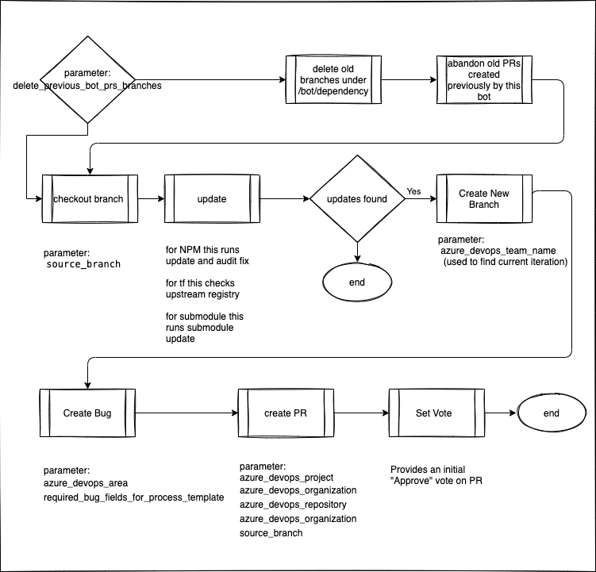

# Dependency Bot

An Azuze DevOps pipeline that updates downstream dependencies and raises a pull request against the source system.


## Using Dependency Bot
currently implemented for NPM type projects

include in your project with reference to this pipeline, and adjust the parameters accordingly

```yml
trigger: none

schedules:
- cron: '30 2 * * *'
  branches:
    include:
    - develop
  always: true

resources:

  #if the project is not in accenture08 use this
  repositories:
    - repository: Azure-Pipelines-Template-AIR2731
      endpoint: CIO EA Cross Organization Access-REBAR_2731Git
      name: cio-common/BuildTemplates
      ref: master
      
  #if the project is in accenture08 use this
  repositories:
    - repository: Azure-Pipelines-Template-AIR2731
      type: git
      name: EnterpriseArchitecture_2641/Azure-Pipelines-Template-AIR2731
      ref: master

extends:
  template: templates/dependency-bot-pipelines/dependency-bot-npm.yml@Azure-Pipelines-Template-AIR2731
  parameters:
    azure_devops_team_name: ''
    azure_devops_repository: ''
    azure_devops_organization: ''
    azure_devops_project: ''
    source_branch: ''
    delete_previous_bot_prs_branches: true
    required_bug_fields_for_process_template: ''
```

requires the following properties set:
```yml
# used to query for current iteration (e.g. "Application Architecture -  Engineering Delivery")
- name: 'azure_devops_team_name'
  type: string
  default: ''
# used for raising PRs against target repository (e.g. "2731REBAR_SPA_Schematics")
- name: 'azure_devops_repository'
  type: string
  default: ''
# used for raising PRs against target organization (e.g. "https://dev.azure.com/accenturecio08/")
- name: 'azure_devops_organization'
  type: string
  default: ''
# used for raising PRs against target PROJECT (e.g. "EnterpriseArchitecture_2641")
- name: 'azure_devops_project'
  type: string
  default: ''
# used for raising PRs against target (i.e.  we start from this branch, and merge back into it) (e.g. "develop")
- name: 'source_branch'
  type: string
  default: 'develop'
# used to clean any previous dependency-bot artifacts (PRs and or branches) 
- name: 'delete_previous_bot_prs_branches'
  type: string
  default: 'false'
# pass any required fields to create a bug, semicolon delimited
# e.g. scrum_stage found=Build;mytitle=val
- name: 'required_bug_fields_for_process_template'
  type: string
  default: ''
```